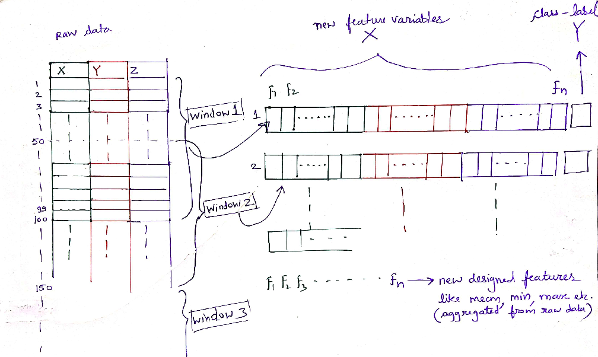

# Continuous Authentication using Time-Series Mobile Phone Gyroscope Data to detect Sobriety

## Table of Contents

- [Table of Contents](#table-of-contents)
- [Introduction](#introduction)
- [Already Existing Approaches](#already-existing-approaches)
- [Prior Work](#prior-work)
- [Our Proposed Approach](#our-proposed-approach)
- [What needs to be accomplished](#what-needs-to-be-accomplished)
- [Backend Server](#backend-server)
    - [Using Client-Server Architecture](#client-server-architecture)
    - [Using Publish-Subscribe Architecture](#publish-subscribe-architecture)
- [ML Workflow](#ml-workflow)
    - [Data Gathering](#data-gathering)
    - [Data Cleaning & Preprocessing](#data-cleaning-&-preprocessing)
    - [Data Segmentation](#data-segmentation)
    - [Feature Extraction](#feature-extraction)
    - [Training Classifiers](#training-classifiers)
    - [Evaluating Performance](#evaluating-performance)
- [Measuring the Success of the System](#measuring-the-success-of-the-system)
- [Results](#results)
- [Conclusion](#conclusion)
- [Our Team](#our-team)
- [References](#references)
- [Related Links](#related-links)

## Introduction

Alcohol is a substance that reduces the function of the brain, impairing thinking, reasoning, and muscle coordination. All these abilities are essential to operate a vehicle safely. Drinking alcohol can make us prone to accidents, both minor and serious, such as road traffic accidents, falls, drowning, poisoning and other unintentional injuries. In fact, just under one-third (29%) of all alcohol-attributable deaths are caused by unintentional injury. Following figures show some statistical data about deaths caused by drunk driving.

Source: Global status report on road safety 2015 |  Source: Sri Lanka Police (Sunday Observer, 13th February 2022)
:-------------------------:|:-------------------------:
  |  

An *e-scooter* or electric scooter is a stand-up scooter powered by an electric motor classified as a form of micro-mobility. Recently, electric kick scooters (e-scooters) have grown in popularity with the introduction of scooter-sharing systems that use apps allowing users to rent the scooters by the minute. The following is a picture of a dock of e-scooters just for the reference of the reader.

A research done in the US evaluated 103 people who were admitted to ERs due to a scooter accident.

- 48 % of the patients tested for alcohol were way above the legal limit.
- 52 % of those assessed for drug use tested positive.

E-scooter drivers are prone to alcohol-fuelled risk taking, such as kerb jumping, the analysis of e-scooter injuries in the German city of Berlin revealed.

This project focuses on trying to solve the problem of drunk driving for *e-scooters* by **using mobile phone gyroscope data to detect sobriety and continuously authenticate the driver**.

## Already Existing Approaches

Drunk riding is a big problem with shared electric scooters. It’s just as illegal as drunk driving, but that hasn’t stopped scores of riders from engaging in the dangerous practice. [*Bird*](https://www.bird.co/) is one of the largest electric scooter sharing companies in the world. They have recently added an update to their scooter sharing app that requests the rider to type the word "SAFE" into the app before attempting to unlock a scooter. The goal is to give people a moment to pause and reflect on whether they are actually under the influence while attempting to rent an electric scooter.

The electric scooter company [*Lime*](https://www.li.me/electric-scooter) has also taken a similar safety measure to avoid drunk riding. Those who are trying to rent a Lime after 10pm are asked to confirm they are capable of controlling the scooters. When the rider opens the app, a message pops up warning that drinking and riding is dangerous and illegal, and calls the user to ask themselves whether they're safe to ride. It requires the word "yes" to be in before the scooter will unlock.

Following is a drunk test concept for scooter sharing services that was found on dribble. [[Source]](https://dribbble.com/shots/11582376-Lime-Drunk-Test)

However, the above approaches aren't robust and reliable enough to avoid the problem of drunk riding.

## Prior Work

There are a number of research papers that have been published that have focused on detecting alcohol usage using mobile phone non-sensitive sensor data. These include:

- [Learning to Detect Heavy Drinking Episodes Using Smartphone Accelerometer Data](http://ceur-ws.org/Vol-2429/paper6.pdf)
- [An artificial neural network for movement pattern analysis to estimate blood alcohol content level](https://doi.org/10.3390/s17122897)
- [Using Phone Sensors and an Artificial Neural Network to Detect Gait Changes During Drinking Episodes in the Natural Environment](https://doi.org/10.1016/j.gaitpost.2017.11.019)

However, none of the e-scooter sharing services have taken similar approaches (using non-sensitive smartphone sensor data) to detect sobriety.

## Our Proposed Approach

The vision of our project is to create a major impact on reducing the risk of drunk driving, alcohol poisoning, and violence. However, the major goal of our project is to create a robust and reliable system that detect sobriety level using mobile phone gyroscope data and authenticate the user depending on that, which can be integrated into current e-scooter sharing services to unlock the e-scooters only if the user isn't drunk. Hence, we are creating an intelligent API which is capable of passively tracking gyroscopic data to identify sobriety level in real-time.

There're several ways to detect drinking events reliably and accurately such as: measuring the blood alcohol content (BAC) or transdermal alcohol content (TAC). However, passively measuring BAC or TAC in real-time is challenging and impractical. Some smartphone applications allow users to enter their height, weight, and number of drinks consumed over a period of time to calculate their estimated BAC, but these require active user input that could lead to selection bias and obstruct large-scale adoption. Some smartwatches can measure TAC but these devices are expensive. But, smartphone-based solutions are readily scalable since they require no new technological adoption by the user.

By getting insights from the above research papers, we have come up with a system which uses mobile phone gyroscope data as well as TAC readings (to be served as the ground-truth when training the system to make classifications, rather than using potentially biased self-reports), that is collected from several volunteers participating in alcohol-related events, to train a classifier model to detect whether a user is sober or not. We'll be running the trained model on a server such that any e-scooter sharing service can use our API to send the user's gyroscope data to the server and get the results back within a few seconds. The mobile phone application will need to send the gyroscope data continuously (or at least continuously after a certain interval) to the server to track the user's activity. Since we're using raw gyroscope data rather than highly sensitive user data such as keystrokes, calls or location, it'll be very important for the system's adoption as digital privacy concerns grow. In addition to the server and the API, we'll also create a prototype mobile phone application that can measure gyroscope data and send them to the server in real-time as well as to display the results.

## What needs to be accomplished

Given the high-level requirements of the project, we were able to split the requirements into five deliverables:

- **Data Collection**: We have to gather data from various volunteers to train the model.
- **A classifier model that can accurately detect sobriety**: We need to train a classifier model to detect whether a user is sober or not.
- **A server that can serve the model**: We need to create a server that runs the trained model and can serve the model to the e-scooter sharing services via an API.
- **A mobile phone application**: We need to create a (prototype) mobile phone application that can measure gyroscope data and send them to the server in real-time as well as to display the results.
- **The server should be scalable, it must be able to recieve and handle streams of data from multiple users, and it must be able to run the classifier model in real-time for multiple users**: We need to find solutions for all these challenges. We will need to parallelize the server program to handle multiple users. Using HTTP/2 might be a good option since it is highly efficient, and has fully asynchronous multiplexing of requests using streams.

## Backend Server

We need a backend server to implement the following
- Receive and handle streams of data from multiple users.
- Run the classifier and obtain a result.
- Return the result to the relevant user.
To achieve the above using a scalable backend server, we considered the following 2 architectures.

### Client-Server Architecture

We could use a RPC or REST API using Node.js Stream API to receive a stream of gyroscopic data from the users and return a result after running the classifier on the clean data extracted after preprocessing the streams of gyroscopic data received from the users. This architecture had a number of problems for our use case.
- The connection between the client and the server will have to be kept alive until:
    - the entire stream of data is sent to the server
    - data received by the server is preprocessed and the required features are extracted.
    - the classier runs and returns the result
        this could take awhile, but the connection will have to be kept alive idle during this time. Since a large number of clients are expected to connect with the server, these idle connections could add upto a large overhead.
    
- There is no way for the server to establish a connection with the user and send messages/data. The user always has to be the one to establish the connection. 
    
To overcome these problems, we came up with a publish-subscribe architecture using MQTT protocol

### Publish-Subscribe Architecture

We are using the MQTT protocol with hivemq public broker to implement the connection between the server and the mobile phones.
[write more on this after immplementing the server and the mobile app]

## ML Workflow

Following is the workflow that we have planned for the machine learning aspect of the project. All the data processing and machine learning implementations will be done in [this](https://github.com/sathiiii/sobriety-detection-using-mobile-phone-gyroscope-data) repository separately because of the git LFS constraints.

### Data Gathering

Our machine learning model will have to deal with following kind of time-series gyroscope / accelerometer data:

A Gyroscope can be understood as a device that is used to maintain a reference direction or provide stability in navigation, stabilizers, etc. Similarly, a gyroscope or a Gyro sensor is present in a smartphone to sense angular rotational velocity and acceleration.

However, since collecting data from scratch using volunteers is not feasible given the time-frame for the project, we will be using data from [this](http://archive.ics.uci.edu/ml/datasets/Bar+Crawl%3A+Detecting+Heavy+Drinking) pre-existing accelerometer dataset that was collected from 13 participants in a bar crawl event. We'll be using this dataset to build a classifier model as a **proof of concept**. The dataset also provide TAC readings for each participant that can be used as the ground-truth labels when training the model. The TAC readings have been already cleaned by:

1. Processing with a zero-phase low-pass filter to smooth noise without shifting phase.
2. Shifting backwards by 45 minutes so the labels more closely match the true intoxication of the participant (since alcohol takes about 45 minutes to exit through the skin).

Following is a snapshot of how the data looks like when grouped by participant:

TAC has been measured in g/dl where *0.08 is the legal limit* for intoxication while driving. If the TAC reading is less than 0.02, the participant is considered to be *not drunk*. If the TAC reading is greater than 0.02 and less than 0.08, the participant is considered to be *sober*. If it is greater than 0.08, the participant is considered to be *intoxicated*.

The accelerometer data was collected from smartphones at a sampling rate of 40Hz. TAC data was collected using SCRAM ankle bracelets and was collected at 30 minute intervals.

### Data Cleaning & Preprocessing

The basic cleaning procedures that can be done on time-series data are dropping the null and zero values. Also, for each axis of accelerometer data, the outliers (noise) must be removed using an appropriate filter (in frequency domain). According to a paper mentioned above, it was found that a 15th order Chebyshev type II filter works well with fstop = 2.7Hz because the **average human walking frequency** is about 2Hz. As mentioned in the previous section, the TAC data is already cleaned and does not need any further cleaning.

In addition to cleaning, the data preparation steps mainly depends on the approach that we take to solve our time-series classification problem. Given the goal to detect sobriety using mobile phone gyroscope data (however, since we'll be using accelerometer data as a proof of concept, the further sections will mention about accelerometer data and not gyroscope data), there're two ways to build a classifier model:

1. Personalized classifier model: Model sobriety classification from the data **per participant**.
2. Generalized classifier model: Here, the model will be trained on **cross-participant** data. Thus, the model will be able to detect sobriety from any participant's data.

What we're interested in is the latter approach because our goal is to build a generalized classifier model. Therefore, standardization of the data is certainly required since the data collected from different participants involves various types of smartphone sensors. Normalizing the data across participants after per participant standardization may also be useful.

### Data Segmentation

Data segmentation is the next step in the data preparation process after cleaning and preprocessing. Raw time-series data must be **re-framed** as a supervised learning dataset before we can start using machine learning / deep learning algorithms. There is no concept of input and output features in time-series data. Instead, we must choose the variable to be predicted and use feature engineering to construct all of the inputs that will be used to make predictions for future time steps. In order to extract the features, we must segment the huge stream of data into smaller chunks. This segmentation process is also known as **windowing**.

There're two popular ways of windowing:

1. Discrete windows.
2. Overlapping windows with 50% overlap: This ensures that every subsequent row in the transformed dataset has some information from the data in previous window as well.

Choosing the optimal window size can be a crucial step in the data segmentation process. What we should aim for is to extract the repetitive patterns (features) in the motion data. Thus, too less window-size may not capture the motion correctly, while too large window-size results in less data points in transformed dataset for training.

[[Source]](https://towardsdatascience.com/feature-engineering-on-time-series-data-transforming-signal-data-of-a-smartphone-accelerometer-for-72cbe34b8a60)

### Feature Extraction

### Training Classifiers

### Evaluating Performance

## Measuring the Success of the System

To validate the results of the end product throughout the implementation and testing phases, we will be using SCRAM ankle bracelets to measure the TAC readings, so we can compare those with our model's predictions. Following is a picture of such SCRAM ankle bracelet:

Since we have an already formulated goal for the end product, we'll use the following metrics to continuously measure the success of the project.

- **Measuring the before and the after**: Looking at the before and the after of the system is a very good way to measure the success. To do that, we'll keep track of the **time to market**, which is the time taken to deliver the next valueable thing. This will be our highest priority because we want to make sure that we're able to satisfy the product owner through early and continuous delivery of valueable software. We'll always monitor the **product owner's satisfaction level** in each meeting by asking them to rate how well they percieve things are working according to a numeric scale. We'll also do testing thoroughly in order to enhance the **quality of the product**.

- **Measuring the amount of work remaining**: We will keep track of the amount of work that is left to be done in each sprint. To do that, we will use burndown charts.

## Our Team

## Related Links

[University of Peradeniya](https://www.pdn.ac.lk/academics/academics.php/)

[Faculty of Engineering](http://eng.pdn.ac.lk/)

[Department of Computer Engineering](http://www.ce.pdn.ac.lk/)
