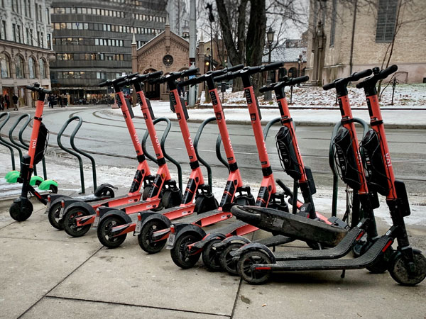

# Continuous Authentication using Time-Series Mobile Phone Gyroscope Data to detect Sobriety

## Table of Contents

- [Table of Contents](#table-of-contents)
- [Introduction](#introduction)
- [Already Existing Approaches](#already-existing-approaches)
- [Our Approach](#our-approach)
- [What needs to be accomplished](#what-needs-to-be-accomplished)
- [ML Workflow](#ml-workflow)
    - [Data Gathering](#data-gathering)
    - [Data Cleaning & Preprocessing](#data-preprocessing)
    - [Data Segmenation](#data-segmenation)
    - [Feature Extraction](#feature-extraction)
    - [Training Classifiers](#training-classifiers)
    - [Evaluating Performance](#evaluating-performance)
- [Measuring the Success of the System](#measuring-the-success-of-the-system)
- [Results](#results)
- [Conclusion](#conclusion)
- [Our Team](#our-team)
- [References](#references)
- [Related Links](#related-links)

## Introduction

Alcohol is a substance that reduces the function of the brain, impairing thinking, reasoning, and muscle coordination. All these abilities are essential to operate a vehicle safely. Drinking alcohol can make us prone to accidents, both minor and serious, such as road traffic accidents, falls, drowning, poisoning and other unintentional injuries. In fact, just under one-third (29%) of all alcohol-attributable deaths are caused by unintentional injury. Following figures show some statistical data about deaths caused by drunk driving.

Source: Global status report on road safety 2015 |  Source: Sri Lanka Police (Sunday Observer, 13th February 2022)
:-------------------------:|:-------------------------:
  |  

An *e-scooter* or electric scooter is a stand-up scooter powered by an electric motor classified as a form of micro-mobility. Recently, electric kick scooters (e-scooters) have grown in popularity with the introduction of scooter-sharing systems that use apps allowing users to rent the scooters by the minute. The following is a picture of a dock of e-scooters just for the reference of the reader.

A research done in the US evaluated 103 people who were admitted to ERs due to a scooter accident.

- 48 % of the patients tested for alcohol were way above the legal limit.
- 52 % of those assessed for drug use tested positive.

E-scooter drivers are prone to alcohol-fuelled risk taking, such as kerb jumping, the analysis of e-scooter injuries in the German city of Berlin revealed.

This project focuses on trying to solve the problem of drunk driving for *e-scooters* by **using mobile phone gyroscope data to detect sobriety and continuously authenticate the driver**.

## Already Existing Approaches

Drunk riding is a big problem with shared electric scooters. It’s just as illegal as drunk driving, but that hasn’t stopped scores of riders from engaging in the dangerous practice. [*Bird*](https://www.bird.co/) is one of the largest electric scooter sharing companies in the world. They have recently added an update to their scooter sharing app that requests the rider to type the word "SAFE" into the app before attempting to unlock a scooter. The goal is to give people a moment to pause and reflect on whether they are actually under the influence while attempting to rent an electric scooter.

The electric scooter company [*Lime*](https://www.li.me/electric-scooter) has also taken a similar safety measure to avoid drunk riding. Those who are trying to rent a Lime after 10pm are asked to confirm they are capable of controlling the scooters. When the rider opens the app, a message pops up warning that drinking and riding is dangerous and illegal, and calls the user to ask themselves whether they're safe to ride. It requires the word "yes" to be in before the scooter will unlock.

Following is a drunk test concept for scooter sharing services that was found on dribble (source: https://dribbble.com/shots/11582376-Lime-Drunk-Test).

However, the above approaches aren't robust and reliable enough to avoid the problem of drunk riding.

## Prior Work

There are a number of research papers that have been published that have focused on detecting alcohol usage using mobile phone non-sensitive sensor data. These include:

- [Learning to Detect Heavy Drinking Episodes Using Smartphone Accelerometer Data](http://ceur-ws.org/Vol-2429/paper6.pdf)
- [An artificial neural network for movement pattern analysis to estimate blood alcohol content level](https://doi.org/10.3390/s17122897)
- [Using Phone Sensors and an Artificial Neural Network to Detect Gait Changes During Drinking Episodes in the Natural Environment](https://doi.org/10.1016/j.gaitpost.2017.11.019)

However, none of the e-scooter sharing services have taken similar approaches (using non-sensitive smartphone sensor data) to detect sobriety.

## Our Proposed Approach

The vision of our project is to create a major impact on reducing the risk of drunk driving, alcohol poisoning, and violence. However, the major goal of our project is to create a robust and reliable system that detect sobriety level using mobile phone gyroscope data and authenticate the user depending on that, which can be integrated into current e-scooter sharing services to unlock the e-scooters only if the user isn't drunk. Hence, we are creating an intelligent API which is capable of passively tracking gyroscopic data to identify sobriety level in real-time.

There're several ways to detect drinking events reliably and accurately such as: measuring the blood alcohol content (BAC) or transdermal alcohol content (TAC). However, passively measuring BAC or TAC in real-time is challenging and impractical. Some smartphone applications allow users to enter their height, weight, and number of drinks consumed over a period of time to calculate their estimated BAC, but these require active user input that could lead to selection bias and obstruct large-scale adoption. Some smartwatches can measure TAC but these devices are expensive. But, smartphone-based solutions are readily scalable since they require no new technological adoption by the user.

By getting insights from the above research papers, we have come up with a system which uses mobile phone gyroscope data as well as TAC readings (to be served as the ground-truth when training the system to make classifications, rather than using potentially biased self-reports), that is collected from several volunteers participating in alcohol-related events, to train a classifier model to detect whether a user is sober or not. We'll be running the trained model on a server such that any e-scooter sharing service can use our API to send the user's gyroscope data to the server and get the results back within a few seconds. The mobile phone application will need to send the gyroscope data continuously (or at least continuously after a certain interval) to the server to track the user's activity. Since we're using raw gyroscope data rather than highly sensitive user data such as keystrokes, calls or location, it'll be very important for the system's adoption as digital privacy concerns grow. In addition to the server and the API, we'll also create a prototype mobile phone application that can measure gyroscope data and send them to the server in real-time and also to display the results.

## What needs to be accomplished

## ML Workflow

## Measuring the Success of the System

## Our Team

## Related Links

[University of Peradeniya](https://www.pdn.ac.lk/academics/academics.php/)

[Faculty of Engineering](http://eng.pdn.ac.lk/)

[Department of Computer Engineering](http://www.ce.pdn.ac.lk/)